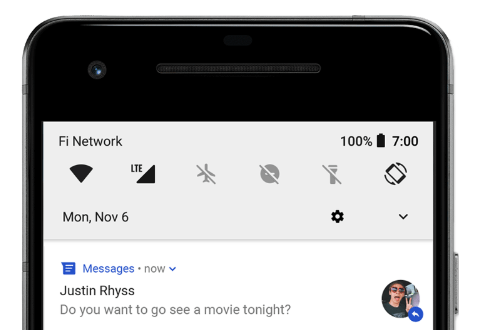
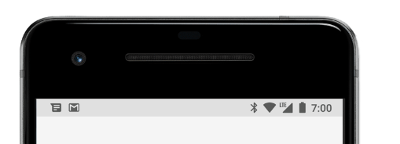
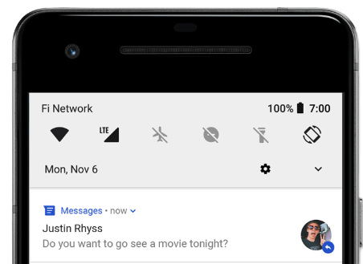
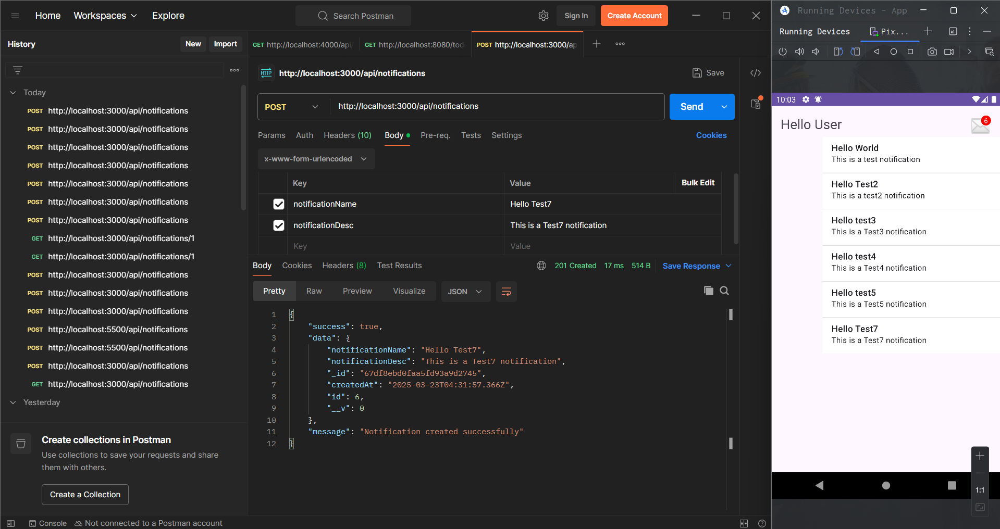
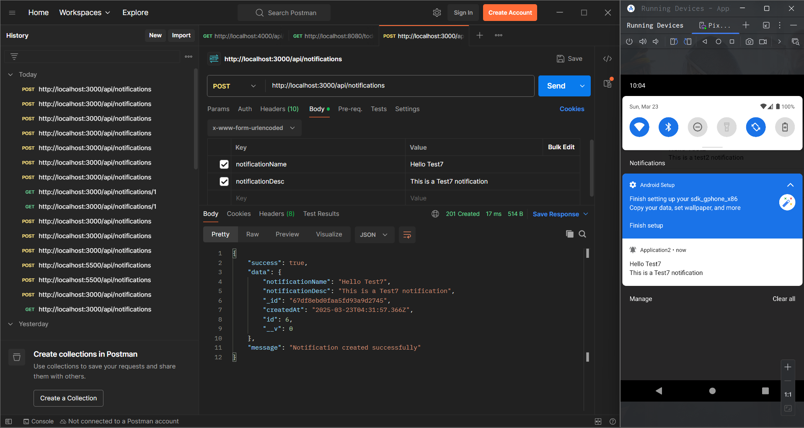
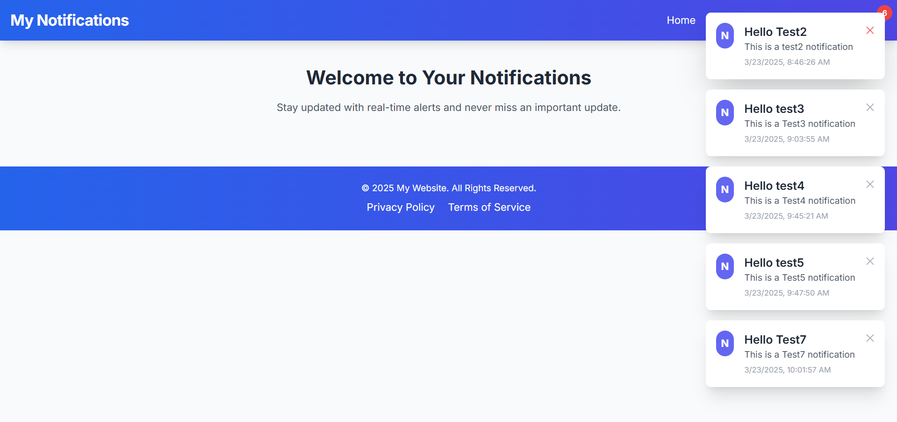
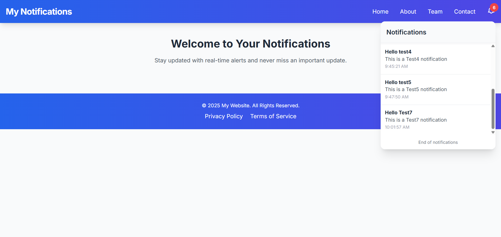

# **Notification API using Android, Node.js, and MongoDB**

## **Overview**

This project provides a **Notification API** built with **Node.js** and  **MongoDB** , which integrates with an **Android application** using **Volley and WorkManager** for efficient API communication and background task execution.

---

## **Technologies Used**

### **Backend (Node.js & MongoDB)**

* **Node.js** - Server-side framework.
* **Express.js** - Fast and minimal web framework.
* **MongoDB** - NoSQL database for storing notifications.
* **Mongoose** - ODM for MongoDB.
* **CORS** - Middleware to enable cross-origin requests.

### **Android (Client-side)**

* **Volley** - Networking library for API requests.
* **WorkManager** - Background task execution.

---

## **Backend Setup**

### **1️⃣ Install Dependencies**

Run the following command in your **Node.js project** directory:

```sh
npm install express mongoose cors
```

### **2️⃣ Package.json Dependencies**

Your `package.json` should include:

```json
"dependencies": {
    "cors": "^2.8.5",
    "express": "^4.21.2",
    "mongoose": "^8.12.2"
}
```

### **3️⃣ Start the Server**

Run the server:

```sh
node index.js
```

or

```sh
nodemon index.js
```

---

## **Android Setup**

### **1️⃣ Add Dependencies**

In your  **Android `build.gradle` (Module: app)** , add:

```gradle
dependencies {
    implementation 'androidx.work:work-runtime:2.8.1'
    implementation 'com.android.volley:volley:1.2.1'
}
```

### **2️⃣ Make an API Request with Volley**

Example  **Volley request** :

```java
String url = "http://yourserver.com/api/notifications";
RequestQueue queue = Volley.newRequestQueue(context);
JsonObjectRequest request = new JsonObjectRequest(Request.Method.GET, url, null,
    response -> {
        Log.d("API_RESPONSE", response.toString());
    }, 
    error -> Log.e("API_ERROR", error.toString())
);
queue.add(request);
```

---

## **API Endpoints**

| Method           | Endpoint                   | Description               |
| ---------------- | -------------------------- | ------------------------- |
| **POST**   | `/api/notifications`     | Create a new notification |
| **GET**    | `/api/notifications`     | Get all notifications     |
| **DELETE** | `/api/notifications/:id` | Delete a notification     |

---

## **Database Schema (MongoDB)**

```javascript
const notificationSchema = new mongoose.Schema({
    id: {
        type: Number,
        unique: true
    },
    notificationName: {
        type: String,
        required: true
    },
    notificationDesc: {
        type: String,
        required: true
    },
    createdAt: {
        type: Date,
        default: Date.now
    }
});
```

---

## **Running the Project**

1. **Start MongoDB** (`mongod`)
2. **Run the backend** (`node index.js`)
3. **Run the Android app** and test API calls.


### **Note:**

- Make sure all **image files (1.png to 7.png)** are in the same directory as the README.
- If hosting on GitHub, place images inside a `/images` folder and update the paths like:

  ```md

  
  
  
  
  
  
  

  ```
